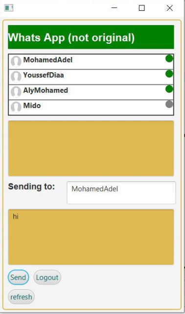
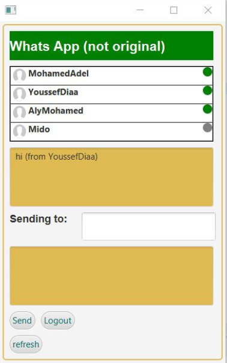

#### Description
A chatting application simulated on Java using socket APIs to deliver and receive 
messages from different open sockets. :computer:

#### To get started

- First clone the repo and import it into your favorite Java IDE.

- After you import it run the class called "s1" then "s2" these represent Servers 1 and 2.

- To add a user to the messaging application run either "c1" or "c2" these represent Clients 1 and 2.

- Client 1 is connected to Server 1 and Client 2 is connected with Server 2 to simulate a client/server architecture.

- When you run Client 1/2 a window should appear for the user to log in.

- After that the user can chat with the other online users as seen below.

- This indicator :white_circle: means that the user is currently offline, while a green one means that they're online now.

Youssef's Window           |  Mohamed's Window
:-------------------------:|:-------------------------:
   |  

#### Further Development
- You are welcome to develop the project by adding further functionalities to the project itself.

